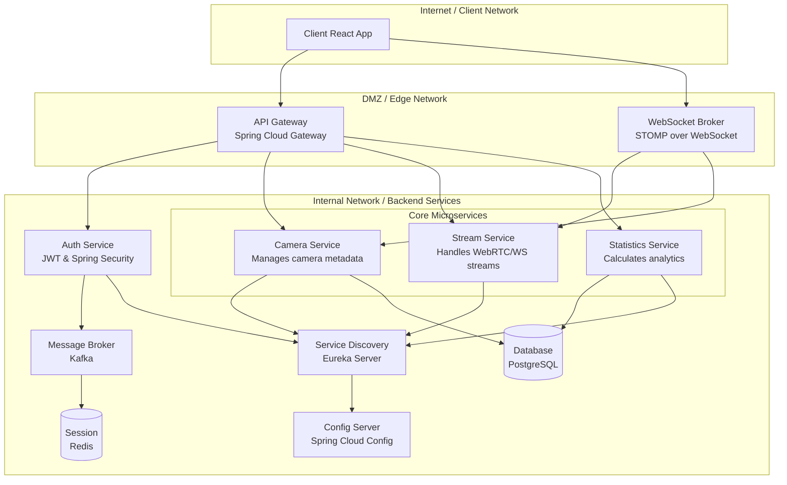

```mermaid
flowchart TD
    client[Client React App]

    subgraph Internet["Internet / Client Network"]
        client
    end

    subgraph DMZ["DMZ / Edge Network"]
        GW[API Gateway<br>Spring Cloud Gateway]
        WSS[WebSocket Broker<br>STOMP over WebSocket]
    end

    subgraph InternalNetwork["Internal Network / Backend Services"]
        AUTH[Auth Service<br>JWT & Spring Security]
        EUREKA[Service Discovery<br>Eureka Server]
        CONFIG[Config Server<br>Spring Cloud Config]

        subgraph CoreMicroservices["Core Microservices"]
            CAM[Camera Service<br>Manages camera metadata]
            LIVE[Stream Service<br>Handles WebRTC/WS streams]
            STAT[Statistics Service<br>Calculates analytics]
        end

        DB[(Database<br>PostgreSQL)]
        REDIS[(Session<br>Redis)]
        MQ[Message Broker<br>Kafka]

        AUTH --> MQ
        MQ --> REDIS
        STAT --> DB
    end

    client --> GW
    client --> WSS
    GW --> AUTH
    GW --> CAM
    GW --> LIVE
    GW --> STAT
    WSS --> LIVE
    WSS --> CAM
    AUTH --> EUREKA
    CAM --> EUREKA
    CAM --> DB
    LIVE --> EUREKA
    STAT --> EUREKA
    EUREKA --> CONFIG
```
